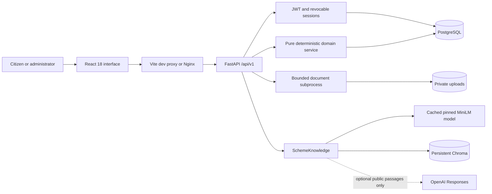
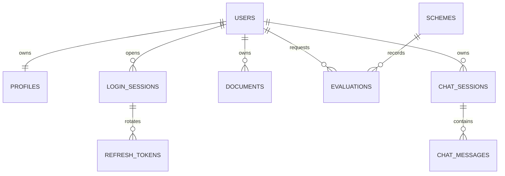

# Architecture

Sahaay is a single-installation academic prototype. A React application talks to one FastAPI backend; PostgreSQL stores transactional records, private filesystem storage holds uploads, and Chroma stores only scheme knowledge. Alembic is the schema authority. The optional provider is used only for public source-quotation selection.

## Components and responsibilities

| Component | Implementation | Responsibility |
| --- | --- | --- |
| API and ownership | `backend/app/main.py` | Request validation, citizen ownership, role enforcement, catalog, documents, chat, readiness, exports, analytics |
| Identity | `backend/app/security.py` | Argon2 hashing, JWT validation, session revocation and token issuing |
| Configuration | `backend/app/config.py` | Typed environment settings; PostgreSQL-only database URLs; generated secrets |
| Persistence | `backend/app/models.py`, `db.py`, `alembic/` | SQLAlchemy mapping, sessions and migration-managed schema |
| Business logic | `backend/app/domain.py` | Profile normalization, typed rule validation, three-valued evaluation, scores and readiness |
| Documents | `backend/app/documents.py` | Actual content validation, isolated parsing, synthetic-template classification, evidence and comparisons |
| Knowledge | `backend/app/rag.py` | Provenance-preserving chunks, real embeddings, persistent indexing, retrieval and local/live answers |
| Setup | `backend/app/cli.py`, `scripts/` | Idempotent seed, admin creation, index/cache setup and synthetic fixtures |
| Interface | `frontend/src/` | Authentication, profile, catalog, explanations, documents, chat/citations, readiness/export, admin |

## Data model

`users` stores identity, Argon2 hash, role and active status. `profiles` stores the normalized field dictionary as JSONB and a server revision. `login_sessions` stores owner, expiration and revocation; `refresh_tokens` stores only a SHA-256 token digest plus the used flag. Retaining used digests makes refresh replay detectable.

`schemes` stores a stable ID, full validated JSONB specification, published/active flag and revision. `documents` stores owner, original display filename, generated storage filename, extraction JSONB and separate corrections. The private file is outside the public web tree. `evaluations` records a result snapshot with owner, scheme, timestamp and status. `chat_sessions` and `chat_messages` are private to the owning account.

JSONB stores bounded, validated nested rules and evidence without adding an unnecessary table for every rule node. Relational owner/session foreign keys preserve authorization boundaries. Database deletion cascades handle related records; document deletion also removes the corresponding private file through the API.

## Citizen data flow

1. Registration creates a citizen, empty profile and revocable login session. Public requests cannot choose their role.
2. Profile edits are normalized, validated and merged with the stored profile; supplied nulls clear fields, while zero and false remain supplied values. The profile revision changes.
3. Eligibility evaluates the selected current scheme against the saved profile. The result includes the evaluation date, profile/rule revisions, relevant unknown fields, source references and a full rule trace.
4. Recommendations rank published schemes by eligibility, then bounded deterministic relevance, then stable ID. Readiness is recomputed from current profile data and private document comparisons.
5. The authenticated HTML preparation export contains an escaped snapshot of guidance, checklist, sources and remaining actions. A fictional scheme has no invented government application link.

There is no cached readiness result whose stale value could survive a profile/document edit. Historical evaluations are labeled as evaluations at a point in time; the analytics distribution counts these stored evaluation events rather than distinct citizens or current entitlement.

## Retrieval data flow

Each source passage is split into bounded chunks that retain scheme ID, title, source reference, section/page, rule revision and fictional status. Chunk identity hashes text and metadata. The collection name incorporates the pinned embedding revision. Real normalized MiniLM vectors are supplied to Chroma; no default embedding function or synthetic vector fallback is used.

Before each answer the index is synchronized to current published scheme content. Existing identical chunks are reused, changed chunks receive new IDs, and absent/archived chunks are removed. Chroma cosine retrieval and a conservative token-overlap check select evidence. Local responses display those retrieved passages with citations. Personal eligibility questions are routed by the API to the deterministic service instead of allowing an LLM to decide.

Instruction-like queries/source passages are rejected or excluded. A numeric conflict check compares multiple sources for the same scheme section. This is a limited heuristic, not general semantic contradiction detection. Citation validity and exact extractive support are evaluated separately from the limited topical relevance checks.

Live mode uses the Responses SDK with a 20-second request timeout, one bounded SDK retry and a 1600-token output bound. Only public passages and a locally chosen topic are sent. Structured output selects exact quotations; the server rejects unknown chunk IDs and text that is not a contiguous passage substring. There are no tools for the provider to call. An error is returned visibly in live mode; it cannot silently claim a successful provider response.

## Document data flow and limits

The API streams a bounded upload to a generated filename. Filename validation rejects path separators, size validation caps uploads, and content signatures must match PDF/PNG/JPEG extensions. Parsing runs in a separate killable process with a 15-second timeout. Text PDFs are limited to 20 pages, 100,000 extracted characters and bounded decoded page streams. POSIX parsing applies a 512 MiB address-space limit; native Windows currently has the process/time/input bounds but no equivalent job-object memory cap.

Pillow validates actual images, including dimensions; these return NEEDS_OCR because OCR is disabled. Encrypted/corrupt/empty files return ERROR. Textless PDFs return NEEDS_OCR. Unknown text layouts return NEEDS_MANUAL_REVIEW. Recognized synthetic forms require an in-content template marker and document type, then parse labeled fields with page/text evidence. No filename or invented confidence score authenticates a document.

Original extraction, user corrections and provenance events remain separate. Comparisons use normalized names/strings and exact birth dates/income; missing or invalid values yield UNKNOWN. Corrections do not rewrite the citizen profile. A recognized manually completed form is identified as user-corrected; images and unrecognized templates remain unresolved.

## API conventions

Base path is `/api/v1`, health is `/api/health`, and the generated OpenAPI UI is `/docs`. Authentication uses `Authorization: Bearer <access token>`. Refresh tokens travel in JSON to the refresh endpoint; this implementation does not use authentication cookies. HTTP status codes distinguish validation (422), unauthenticated (401), forbidden administrator action (403), absent/not-owned records (404), conflicts (409), oversized bodies (413), throttling (429) and recoverable service unavailability (503). Client error notices retain editable input on recoverable failures.

| API group | Examples |
| --- | --- |
| Identity | `/auth/register`, `/auth/login`, `/auth/refresh`, `/auth/logout`, `/auth/me` |
| Profiles/catalog | `/profile`, `/schemes`, `/schemes/{id}`, `/recommendations` |
| Evaluation/preparation | `/schemes/{id}/eligibility`, `/schemes/{id}/readiness`, `/schemes/{id}/export` |
| Private documents | `/documents`, `/documents/{id}/download`, `/documents/{id}/corrections` |
| Private chat | `/chat/sessions`, `/chat/sessions/{id}/messages` |
| Admin | `/admin/schemes`, `/admin/schemes/{id}/publish`, `/admin/schemes/{id}/archive`, `/admin/analytics` |

## Security and deployment boundaries

Access tokens last 15 minutes by default. The server checks session state for every authenticated request, so logout invalidates an otherwise unexpired JWT. Refresh rotates random tokens atomically; replay revokes the associated session. The browser keeps access tokens in memory and refresh tokens in tab-local `sessionStorage`. This makes JavaScript/XSS protection important; production hardening could choose a reviewed cookie-based design with the associated CSRF controls.

CORS is restricted to configured origins. Nginx adds content/security headers and proxies same-origin API requests. React renders data as text; preparation HTML escapes content. Resource IDs never authorize access: document and chat queries verify ownership, while profile/readiness/export derive the owner from the authenticated session. Administrator analytics expose aggregates, not raw uploads or conversations.

The documented topology is one backend process with a process-local sliding-window limiter and index lock. Horizontal scaling would require distributed limits, index coordination, shared secure upload storage and a deployment security review. HTTP localhost bindings are for local development, not a public production deployment.

Compose defines separate PostgreSQL/upload/vector/model volumes. The first setup needs network access; cached local mode has no intended runtime network dependency. Compose and non-Windows platforms remain unverified where evidence says BLOCKED/NOT RUN.
